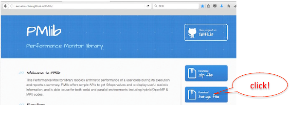

= 10分でわかるPMlib 😚
:author: 三上 和徳
:encoding: utf-8
:lang: jp
:rev: 0.1.0
:revdate: 2016年10月26日

:toc:

理化学研究所 計算科学研究機構
可視化技術研究チーム

== PMlibとは

* アプリケーションの計算性能をモニターするソフトウエアライブラリ::
  * 注目する区間の性能統計情報を簡単に測定・レポートする。
  * Cpp言語、Fortran言語に対応 。
  * Linux系OSをもつコンピュータの上で使える。:::
    * 京コンピュータ・FX100:
    * Intel Xeon系サーバ・PC
    * Apple Macbook
  * オープンソース。:::
    * パッケージ公開リポジトリ:::
      * http://avr-aics-riken.github.io/PMlib/
    * 必要な前提ソフトウエア環境:::
      * Linux OS, Cpp, C, Fortranコンパイラ
      * (オプションに応じて)MPIライブラリ、PAPIライブラリ、OTFライブラリ

== 計算性能のモニターとは?

* 注目する区間を指定して性能統計情報を蓄積・記録すること

* 測定区間は少数の属性を持つ::
  * ラベル:任意の名称 ”ここ”とか”そこ”とか
  * 測定する計算量の種類: 「演算量」、「通信量」など:::
     浮動小数点演算量、データ移動量、その他HW固有の統計量がいくつか選べる
  * 排他性:「排他的」か「非排他的」:::
     他の区間とカブっていないかという意味

* 測定する計算量をどう選択・算出するか?::
  * PMlibがHWPC値を自動測定する方法
  * ユーザが明示的に申告する方法

== PMlibの利用方法

. PMlibライブラリをインストールする
. アプリケーション中の測定区間を決める::
  * ソースプログラム中の注目箇所にPMlib APIを追加
. アプリケーションをコンパイルしてPMlibとリンクする
. アプリケーションを実行する::
  * 実行時に性能統計情報がレポートされる
. 性能統計レポートを確認評価する

== PMlib基本APIの一覧

|===
| 関数名(Cpp)        | 関数名(Fortran)   | 機能                | 呼び出し位置と回 数 |  引数  |

| initialize()       |f_pm_initialize()    | PMlib 全体の初期化  | 冒頭■一回  | (1)測定区間数 |
| setProperties()    |f_pm_setproperties() | 測定区間のラベル化  | 任意■各区間一回 | ⑴ラベル、（2)測定対象タイプ、（3)排他 指定 |
| start()            |f_pm_start()         | 測定の開始          | 任意(startとstopで ペア） | (1)ラベル|
| stop()             |f_pm_stop()          | 測定の停止          | 任意(startとstopで ペア） | (1)ラベル、（2)計算量、（3)計算のタスク 数|
| print()            |f_pm_print()         | 測定区間毎の基本 統計結果表示 | 測定終了時■一回 | (1)出カファイルポインタ、（2)ホスト名、 (3)任意のコメント、（4)区間の表示順 序指定 |
| printDetail()      |f_pm_printdetail()   | MPIランク毎の詳細 性能情報の表示 | 測定終了時■一回 | (1)出カファイルポインタ、（2)記号説明 の表示、（3)区間の表示順序指定 |
|===

== PMlibを利用するプログラムの構成例(Fortran)

|===
|  元のソース    |   PMlib組み込み後のソース |

|
[source,fortran]
----
program main
!  注目箇所
call mykernel() 
end
----
|
[source,fortran]
----
program main
! 初期設定
call f_pm_ini9alize (nWatch)
call f_pm_setproper9es ("Koko!" icalc, iexcl)
! 測定区間
call f_pm_start ("Koko!")
call mykernel (msize,n,a,b,c)
call f_pm_stop ("Koko!", fops, ncall)
! レポート出力
call f_pm_print ("", isort)
call f_pm_printdetail ("", ilegend, isort)
end
----
|
|===

== PMlibを利用するプログラムの構成例(Cpp)

|===
| 元のソース | PMlib組み込み後のソース |

|
[source,cpp]
----
int main(int argc, char *argv[])
{
// 注目箇所
mykernel();
return 0;
}
----
|
[source,cpp]
----
// PMlibヘッダー
#include <PerfMonitor.h>
using namespace pm_lib;
PerfMonitor PM;
int main(int argc, char *argv[])
{
// 初期設定
PM.initalize();
PM.setProper9es("Koko!", PM.CALC);
// 測定区間
PM.start("Koko!");
mykernel();
PM.stop ("Koko!");
// レポート出力
PM.print(stdout, "", "");
PM.printDetail(stdout);
return 0;
}
----
|

== PMlibの出力情報

. 、基本レポート::
  * 各測定区間のプロセスあたり平均性能統計値
    * 時間:各区間の平均時間、呼び出し回数、累積経過時間
    *  計算量:呼び出し1回あたりの量、合計量、速度
    * 区間を登録順または経過時間順にソート出力
  * ジョブ全体での総合性能
. 、詳細プロファイル::
  * 各MPIプロセス毎のプロファイルを出力
  * (オプション)各MPIプロセス毎のHWPCイベント統計量
    * HWPCイベントグループを環境変数で指定
    * プロセスがOpenMPスレッドを発生した場合、各スレッドの計 算量は元プロセスに合算する。
. 、(オプション)ポスト処理用性能トレースファイル

== 基本レポート例 (HWPC自動測定モード

...
# PMlib Basic Report -------------------------------------------------------
Timing Statistics Report from PMlib version 5.0.3
Linked PMlib supports: MPI, OpenMP, HWPC, OTF
Host name : vsp01
Date      : 2016/06/19 : 15:26:50
Mrs. Kobe
Parallel Mode:  Hybrid (4 processes x 4 threads)
The environment variable HWPC_CHOOSER=FLOPS is provided.

Total execution time            = 9.848690e-01 [sec]
Total time of measured sections = 9.816217e-01 [sec]

Exclusive sections statistics per process and total job.
Inclusive sections are marked with (*)

Section           |  call    |     accumulated time[sec]              | [hardware counter byte counts]
Label             |          |   avr     avr[%]    sdv   avr/call     |      avr       sdv   speed
------------------+----------+----------------------------------------+----------------------------
First section     :        1   1.039e-01 10.59 1.32e-03 1.039e-01        4.807e+09 1.89e+06 46.26 Gflops
Second section(*) :        1   8.412e-01 85.70 4.72e-03 8.412e-01        5.226e+09 1.79e+06 6.21 Gflops(*)
Subsection X      :        3   3.106e-01 31.64 9.48e-04 1.035e-01        1.614e+10 3.24e+06 51.97 Gflops
Subsection Y      :        3   3.127e-01 31.85 4.06e-03 1.042e-01        1.568e+10 2.73e+06 50.14 Gflops
------------------+----------+----------------------------------------+----------------------------
Sections per process           7.272e-01     -Exclusive CALC sections- 3.663e+10            50.37 Gflops
------------------+----------+----------------------------------------+----------------------------
Sections total job             7.272e-01      -Exclusive CALC sections- 1.465e+11           201.47 Gflops
...

== 基本レポート例 (ユーザ申告モード)

...
# PMlib Basic Report -------------------------------------------------------

    Timing Statistics Report from PMlib version 5.0.3
    Linked PMlib supports: MPI, OpenMP, HWPC, OTF
    Host name : vsp01
    Date      : 2016/06/19 : 15:28:19
    Mrs. Kobe
    Parallel Mode:    Hybrid (4 processes x 4 threads)
    The environment variable HWPC_CHOOSER is not provided. No HWPC report.

    Total execution time            = 9.795189e-01 [sec]
    Total time of measured sections = 9.816882e-01 [sec]

    Exclusive sections statistics per process and total job.
    Inclusive sections are marked with (*)

    Section           |   call   |      accumulated time[sec]             | [user defined counter values ]
    Label             |          |    avr   avr[%]   sdv     avr/call     |       avr     sdv   speed
    ------------------+----------+----------------------------------------+----------------------------
    First section     :        1   1.043e-01 10.62 1.47e-03 1.043e-01        4.000e+09 0.00e+00 38.35 Gflops
    Second section(*) :        1   8.420e-01 85.77 6.86e-03 8.420e-01        1.960e+10 0.00e+00 23.28 Gflops(*)
    Subsection X      :        3   3.120e-01 31.78 3.28e-03 1.040e-01        4.800e+10 0.00e+00 153.84 GB/sec
    Subsection Y      :        3   3.118e-01 31.76 2.72e-03 1.039e-01        1.440e+10 0.00e+00 46.18 Gflops
    ------------------+----------+----------------------------------------+----------------------------
    Sections per process           4.161e-01     -Exclusive CALC sections- 1.840e+10            44.22 Gflops
    Sections per process           3.120e-01     -Exclusive COMM sections- 4.800e+10           153.84 GB/sec
    ------------------+----------+----------------------------------------+----------------------------
    Sections total job             4.161e-01     -Exclusive CALC sections- 7.360e+10           176.87 Gflops
    Sections total job             3.120e-01     -Exclusive COMM sections- 1.920e+11           615.36 GB/sec
...

== ? 

|===
^| 以降のスライドはコンピュータシステム毎に |
^| 別れた内容になっています。 |
^| Intel環境編 |
^| 京・FX100編 |
^| Mac・OSX編 |
^| 適切なものを選んでお読みください |
|===

== 10分+でできるPMlibのインストールと利用😚

|===
^| Intel環境編 |
^| (Intel サーバ w/ Intelコンパイラ+Intel MPI) |
|===

== PMlibのインストールと利用実行

* PMlibのインストール
  * PMlibパッケージの入手
  *  PMlibのインストール

* PMlibの利用実行
  * 例題プログラムの作成(Cpp言語で作成)
  * 例題プログラムへのPMlibの追加(ソースプログラムの編集)
  * 例題プログラムをコンパイルしてPMlibをリンクする
  * 例題プログラムを実行して、PMlibのレポートを確認する

* `(注)ここではPMlibのインストールと例題プログラムの利用実行が同じ種類のIntel Xeon CPU上で行われることを想定している。`
* `(注)ここではIntelコンパイラ+Intel MPIのソフトウエア環境を想定している。GNUコンパイラ を用いた場合、あるいはOpenMPIを用いた場合などのインストール例についてはパッケージに含まれるINSTALLファイルを参照`

== PMlibパッケージの入手(共通)

* パッケージ公開リポジトリ
  * http://avr-aics-riken.github.io/PMlib/
 

* ダウンロードしたファイル名は avr-aics-riken-PMlib-*.tar.gz
  * (*の部分はバージョンにより変わる)
* ダウンロードしたファイルをインストール先のコンピュータに転送する。手持ちのPCへインストールする場合は、もちろん転送不要。
  * 以降の例では ${HOME}/tmp/ 下に転送したと仮定

== PMlibパッケージの展開(共通)

* インストール先のコンピュータ上で、転送したパッケージを展開する
* 展開したディレクトリにシンボリックリンクと、パスの環境変数を設定する。
* 以下の例ではログイン後ホームに pmlib ディレクトリを作って、その下に転送したパッケージのファイルを展開する。

[source,bash]
----
$ mkdir pmlib
$ cd pmlib
$ tar –zxf ${HOME}/tmp/avr-aics-riken-PMlib-*.tar.gz
$ ls –go
drwxr-xr-x 10 4096 2016-06-21 15:13 avr-aics-riken-PMlib-7d4884d

$ ln –s avr-aics-riken-PMlib-* PMlib
$ ls –go
lrwxrwxrwx 1 12 2016-06-21 15:15 PMlib -> avr-aics-riken-PMlib-7d4884d

$ PMLIB_DIR=${PWD}/PMlib           # PMlibパッケージを展開したディレクトリ
$ INSTALL_DIR=${PWD}/install_dir   # PMlibのインストール先ディレクトリ
$ export PMLIB_DIR INSTALL_DIR
----

== PMlibのインストール Intel環境

* Intel環境用のインストールスクリプト例は以下に提供されている::
 `$ SCRIPTS=${PMLIB_DIR}/doc/scripts/Intel/`

* アプリケーションの種類により、PMlib「1プロセス版」か「MPI版」かのどちらかを使用するので、両方ともインストールする。
* Intelコンパイラ、Intel MPI、PAPIライブラリはシステムによってインストールされているパスが異なる。PMlibインストール用スクリプトで設定されているパスが正しいか確認して、必要であれば修正する。
* 「1プロセス版」のスクリプト ${SCRIPTS}/x.make-pmlib-intel-serial.sh::
  `N行目INTEL_DIR=/usr/local/intel/composer_xe_2013`
  `N行目PAPI_DIR=/usr/local/papi/papi-5.3.2/intel`

* 「Intel MPI版」のスクリプト ${SCRIPTS}/x.make-pmlib-intel-impi.sh::
  `N行目 INTEL_DIR=/usr/local/intel/composer_xe_2013`
  `N行目 MPI_DIR=/usr/local/intel/impi/4.1.0.024`
  `N行目 PAPI_DIR=/usr/local/papi/papi-5.3.2/intel`

== PMlibのインストール Intel環境

* インストールスクリプトを2つ順に実行
[source,bash]
----
$ ${SCRIPTS}/x.make-intel-serial.sh  # 「1プロセス版」PMlibのインストール
$ ${SCRIPTS}/x.make-intel-impi.sh    # 「Intel MPI版」PMlibのインストール
----

* 以下のファイルがインストールされた事を確認する
[source,bash]
----
$ ls –go ${INSTALL_DIR}
drwxr-xr-x 3 102 6 19 17:51 bin
drwxr-xr-x 6 204 6 19 17:51 doc
drwxr-xr-x 7 238 6 19 17:51 include
drwxr-xr-x 4 136 6 19 17:51 lib
drwxr-xr-x 7 238 6 19 17:51 share

$ ls –go ${INSTALL_DIR}/lib
-rw-r--r-- 1 145784 5 27 17:15 libPM.a         # 「1プロセス版」PMlibライブラリ
-rw-r--r-- 1 472104 6 19 17:51 libPMmpi.a      # 「Intel MPI版」PMlibライブラリ
----

* 以上でPMlibインストール終了!
